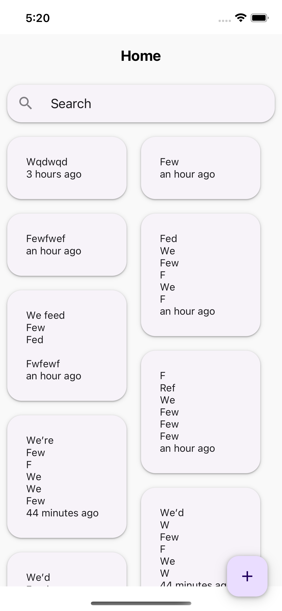

# react-native-masonry-gridview

A React Native component for rendering a masonry layout of items in columns.

## Installation

```sh
npm install react-native-masonry-gridview
```

## Usage

```js
import { MasonryGridView } from 'react-native-masonry-gridview';

// ...

<MasonryGridView
  items={notes}
  columns={2}
  renderItem={(item) => <MasonryNote item={item} />}
/>;
```



## Contributing

See the [contributing guide](CONTRIBUTING.md) to learn how to contribute to the repository and the development workflow.

## License

MIT

---

Made with [create-react-native-library](https://github.com/callstack/react-native-builder-bob)
